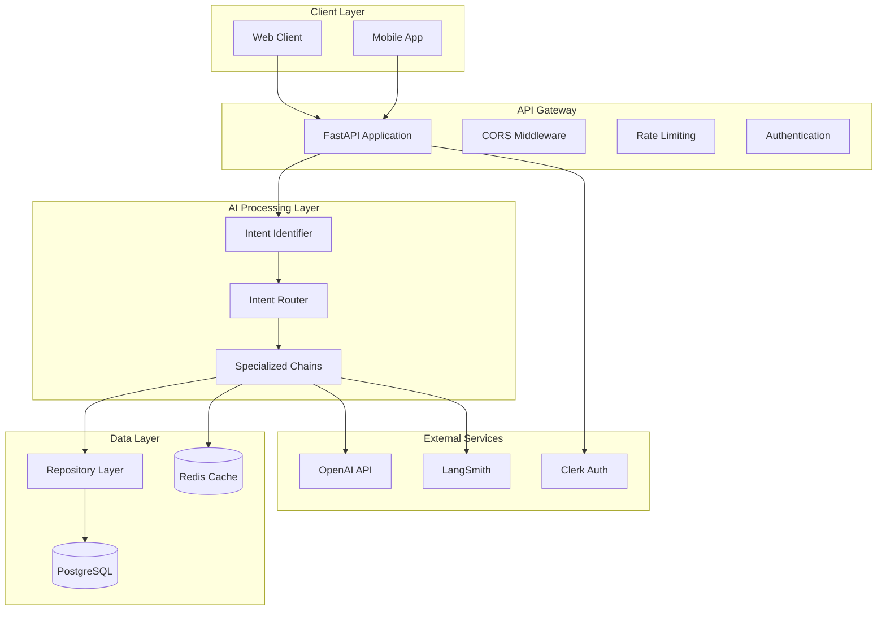
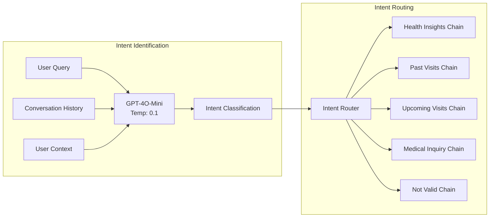
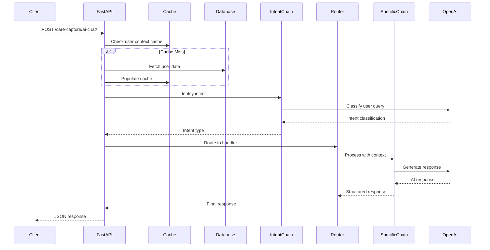
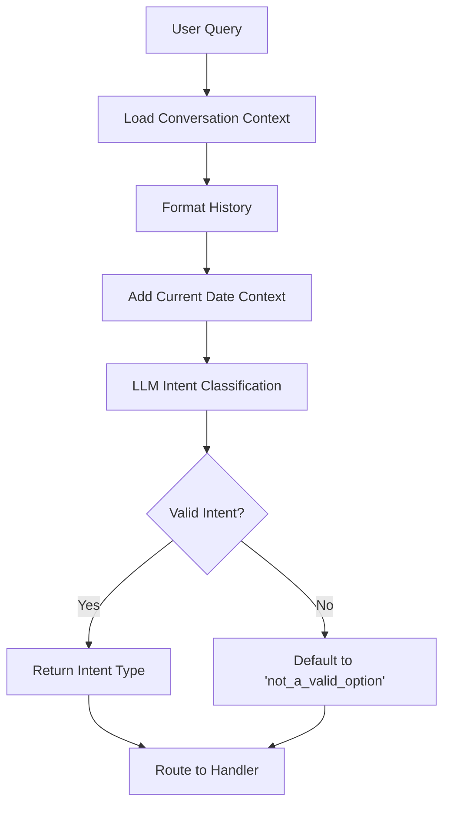
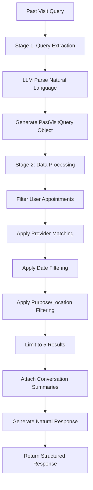
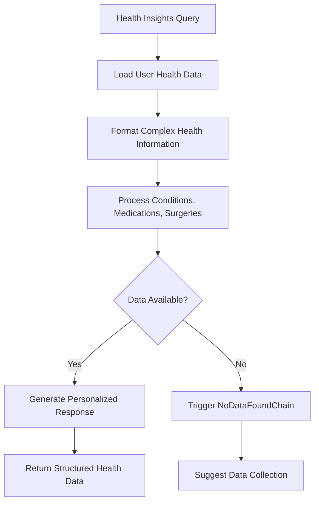
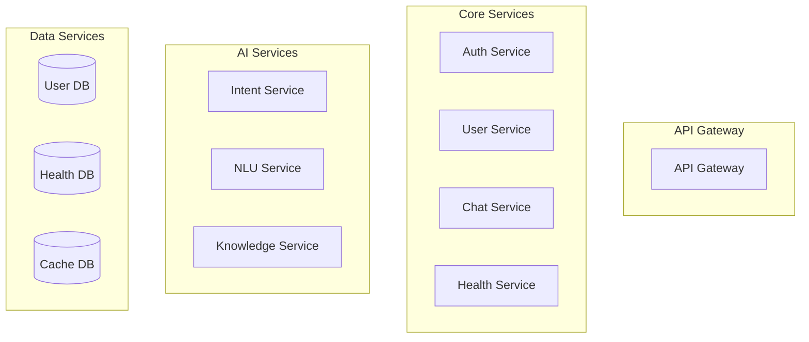

# Care Capture AI - Comprehensive Project Documentation

**Project:** Care Capture FastAPI  
**Version:** 1.0.0  
**Author:** Tulio Health Team  
**Analysis Date:** January 2025  

---

## Table of Contents

1. [Project Overview](#project-overview)
2. [Architecture Overview](#architecture-overview)
3. [AI Chat System Architecture](#ai-chat-system-architecture)
4. [Database Architecture](#database-architecture)
5. [Services and External Integrations](#services-and-external-integrations)
6. [API Flow Documentation](#api-flow-documentation)
7. [Intent Processing Flow](#intent-processing-flow)
8. [Production Readiness Assessment](#production-readiness-assessment)
9. [Recommendations](#recommendations)

---

## Project Overview

### Mission Statement
Care Capture AI aims to make healthcare patient data more meaningful for patients and caregivers through intelligent conversation and automated insights generation.

### Core Capabilities
- **Intelligent Healthcare Chatbot**: AI-powered conversational interface for patient queries
- **Intent-based Query Routing**: Smart categorization and handling of different healthcare inquiries
- **Health Insights Generation**: Automated analysis and summarization of patient health data
- **Medical Appointment Management**: Comprehensive appointment tracking and summarization
- **Provider Integration**: CMS provider data integration for enhanced context

### Technology Stack
- **Backend Framework**: FastAPI (Python 3.12+)
- **Database**: PostgreSQL with SQLAlchemy ORM (async)
- **AI/ML**: OpenAI GPT-4O-Mini via LangChain
- **Caching**: Redis
- **Authentication**: Clerk
- **Background Jobs**: APScheduler
- **Observability**: LangSmith tracing
- **Package Management**: Poetry

---

## Architecture Overview

### High-Level System Architecture



### Core Components

#### 1. **FastAPI Application Layer** (`src/app/main.py`)
- **Lifespan Management**: Redis and scheduler initialization/cleanup
- **Middleware Stack**: CORS, rate limiting, exception handling
- **Router Registration**: Modular API endpoint organization
- **Configuration**: Environment-driven settings management

#### 2. **AI Processing Engine**
- **Intent Classification**: LLM-powered user query categorization
- **Chain-of-Responsibility**: Specialized handlers for different intent types
- **Context Management**: Conversation history and user data integration
- **Response Generation**: Natural language response synthesis

#### 3. **Data Management Layer**
- **Repository Pattern**: Abstracted data access layer
- **Caching Strategy**: Redis-based performance optimization
- **Audit Trails**: Comprehensive tracking of data changes
- **Schema Management**: Pydantic-based data validation

---

## AI Chat System Architecture

### Intent Classification System

The AI chat system uses a sophisticated two-stage approach:

1. **Intent Identification Stage**
2. **Intent Routing and Processing Stage**

### Supported Intent Types

| Intent | Purpose | Priority | Implementation Status |
|--------|---------|----------|----------------------|
| `health_insights` | Personal health data queries | 1 (MVP) | ✅ Complete |
| `past_visits` | Historical appointment queries | 2 | ✅ Complete |
| `upcoming_visits` | Future appointment queries | 3 | ✅ Complete |
| `medical_inquiry` | General medical questions | 4 (MVP) | ✅ Complete |
| `not_a_valid_option` | Invalid/off-topic queries | - | ✅ Complete |
| `end_conversation` | Conversation termination | - | ✅ Complete |
| `manage_visits` | Appointment management | 5 (Post-MVP) | ❌ Planned |

### Intent Processing Architecture



### Specialized Intent Handlers

#### 1. **Health Insights Intent Chain**
- **Purpose**: Process queries about personal health conditions, medications, test results
- **Data Sources**: Patient health insights, user profiles
- **Output**: Structured health information with personalized context
- **Example Queries**: "What conditions do I have?", "Show me my medications"

#### 2. **Past Visits Intent Chain** 
- **Purpose**: Two-stage processing for historical medical appointments
- **Architecture**:
  - **Stage 1**: Natural language → Structured query extraction
  - **Stage 2**: Data filtering → Conversational response generation
- **Features**: Provider name matching, date range filtering, purpose-based search
- **Example Queries**: "Show my visits with Dr. Smith", "What happened in my last appointment?"

#### 3. **Upcoming Visits Intent Chain**
- **Purpose**: Future appointment information and management
- **Data Sources**: Appointments table (future dates)
- **Features**: Similar to past visits but for future appointments
- **Example Queries**: "When is my next appointment?", "Who am I seeing next week?"

#### 4. **Medical Inquiry Intent Chain**
- **Purpose**: General medical education and health information
- **Features**: Context-aware responses, automatic medical disclaimers
- **Safety**: Includes appropriate medical advice disclaimers
- **Example Queries**: "What is diabetes?", "How should I manage high blood pressure?"

---

## Database Architecture

### Entity Relationship Diagram

```mermaid
erDiagram
    USERS ||--o{ USER_PROFILES : has
    USERS ||--o{ APPOINTMENTS : books
    USERS ||--o{ CHATBOT_CONVERSATIONS : participates
    USERS ||--o{ PATIENT_HEALTH_INSIGHTS : generates
    
    APPOINTMENTS ||--o| CONVERSATION_SUMMARIES : summarized_in
    CHATBOT_CONVERSATIONS ||--o{ CHATBOT_MESSAGES : contains
    
    REF_CMS_PROVIDER_DATA ||--o{ APPOINTMENTS : provides
    
    SCHEDULER_JOB_EXECUTION_LOGS
    
    USERS {
        uuid id PK
        string email UK
        string clerk_id UK
        enum status
        datetime created_at
        datetime updated_at
    }
    
    USER_PROFILES {
        uuid id PK
        uuid user_id FK
        string first_name
        string last_name
        string phone_number
        date date_of_birth
        string preferred_language
        string zip_code
        boolean is_active
    }
    
    APPOINTMENTS {
        uuid id PK
        string user_id FK
        uuid provider_id FK
        date appointment_date
        time appointment_time
        integer duration_minutes
        string purpose
        string location
        string status
    }
    
    CONVERSATION_SUMMARIES {
        uuid id PK
        uuid appointment_id FK UK
        uuid user_id FK
        text summary_text
        json key_points
        json medications
        json diagnoses
        json instructions
    }
    
    PATIENT_HEALTH_INSIGHTS {
        uuid id PK
        uuid user_id FK
        integer month
        integer year
        json insight_data
        boolean is_viewed
        json additional_metadata
    }
```

### Key Database Features

1. **UUID Primary Keys**: Distributed system compatibility
2. **JSON Fields**: Flexible data storage for complex healthcare data
3. **Audit Trails**: Created/updated timestamps and user tracking
4. **No Foreign Key Constraints**: Application-level relationship management
5. **Repository Pattern**: Abstracted data access with comprehensive CRUD operations

### Database Models Summary

| Table | Purpose | Key Features |
|-------|---------|--------------|
| `users` | Core user management | Clerk integration, status management |
| `user_profiles` | Extended user information | Demographics, preferences, accessibility |
| `appointments` | Medical appointment tracking | Provider linkage, scheduling, status |
| `chatbot_conversations` | Chat session management | User sessions, context tracking |
| `chatbot_messages` | Individual chat messages | Query/response pairs, intent tracking |
| `conversation_summaries` | Visit summaries | AI-generated summaries with structured data |
| `patient_health_insights` | Health analytics | Monthly insights, JSON data storage |
| `ref_cms_provider_data` | Healthcare provider data | CMS integration, provider demographics |

---

## Services and External Integrations

### Service Layer Architecture

#### 1. **Base Service Pattern**
- **Generic Design**: Type-safe base service with dependency injection
- **Error Handling**: Centralized exception management
- **Logging Integration**: Per-service logger instances
- **Database Integration**: Async session management

#### 2. **Health Insights Service**
- **Repository Integration**: Uses dedicated repositories for data access
- **LLM Processing**: Integrates with LangChain for health analysis
- **Transaction Management**: Database consistency guarantees
- **Job Execution Tracking**: Comprehensive logging for background processes

### External Service Integrations

#### OpenAI Integration
```python
# Configuration Pattern
model = init_chat_model(
    model=LLM_MODEL.GPT_4O_MINI,
    model_provider=LLM_PROVIDER.OPENAI,
    openai_api_key=settings.OPENAI_API_KEY,
    temperature=0.1,  # Varies by use case
)
```

**Features**:
- **LangChain Integration**: Structured LLM interaction
- **Prompt Engineering**: Role-based, context-aware prompts
- **Output Parsing**: Pydantic-based structured responses
- **Chain Composition**: LCEL for complex processing workflows

#### Redis Caching Strategy
```python
# Cache Key Management
CACHE_KEY = {
    "CONVERSATION_USER_PROFILE": "conversation:user-profile:{user_id}",
    "CONVERSATION_PAST_APPOINTMENTS": "conversation:past-appointments:{user_id}",
    "CONVERSATION_HEALTH_INSIGHTS": "conversation:health-insights:{user_id}",
    "CONVERSATION_CHAT_HISTORY": "conversation:{conversation_id}"
}
```

**Patterns**:
- **Singleton Client**: Single Redis instance across application
- **Structured Keys**: Enumerated cache key management
- **Error Resilience**: Graceful degradation on cache failures
- **Performance Optimization**: Reduces database load for frequently accessed data

#### Background Job Scheduling
```python
# APScheduler Integration
scheduler = BackgroundScheduler()
scheduler.add_job(
    func=async_health_insights_generation,
    trigger=IntervalTrigger(hours=settings.HEALTH_INSIGHTS_GENERATION_INTERVAL_HOURS),
    id='health_insights_generation',
    name='Health Insights Generation Job'
)
```

**Features**:
- **Async Support**: Handles async coroutines
- **Lifecycle Tracking**: Database persistence of job execution
- **Error Recovery**: Comprehensive error handling and retry logic
- **Health Insights Automation**: Periodic generation of patient insights

### Infrastructure Components

#### 1. **Logging and Monitoring**
- **Environment-driven Configuration**: LOG_LEVEL, LOG_FILE support
- **Structured Logging**: Consistent format across components
- **LangSmith Tracing**: End-to-end LLM call observability
- **File Rotation**: Automatic log management

#### 2. **Security and Middleware**
- **CORS Configuration**: Flexible origin management
- **Rate Limiting**: Redis-backed request throttling
- **Clerk Authentication**: External auth service integration
- **Exception Handling**: Centralized error response management

#### 3. **Configuration Management**
- **Pydantic Settings**: Type-safe configuration
- **Environment Variables**: `.env` file support
- **Caching**: `@lru_cache` for settings singleton
- **Dynamic Configuration**: Runtime configuration updates

---

## API Flow Documentation

### Primary AI Chat Flow

#### 1. **Request Processing** (`/care-capture/ai-chat/`)



#### 2. **Context Loading Strategy**

The system implements an intelligent caching strategy for user context:

```python
# Cache Keys for User Context
user_profile_key = CACHE_KEY.CONVERSATION_USER_PROFILE.format(user_id)
appointments_key = CACHE_KEY.CONVERSATION_PAST_APPOINTMENTS.format(user_id)
visit_summaries_key = CACHE_KEY.CONVERSATION_PROVIDER_VISIT_SUMMARY.format(user_id)
conversation_messages_key = CACHE_KEY.CONVERSATION_CHAT_HISTORY.format(conversation_id)
health_insights_key = CACHE_KEY.CONVERSATION_HEALTH_INSIGHTS.format(user_id)
```

**Cache Miss Handling**:
- Detects missing cache entries
- Triggers comprehensive data refresh
- Populates all related cache keys
- Ensures data consistency across user session

#### 3. **Response Format**

All AI chat responses follow a consistent structure:

```typescript
interface IntentResponse<T> {
    intent: string;           // RouterOptions enum value
    responses: IntentAiResponse<T>[];
}

interface IntentAiResponse<T> {
    type: "text" | "data" | "error";
    content: string;
    data?: T;
}
```

### Other API Endpoints

#### Health Insights Generation (`/care-capture/users/{user_id}/health_insights`)
- **Purpose**: Create/update user health insights
- **Processing**: Background job triggering
- **Response**: Job status and insight generation confirmation

#### Provider Visit Summarization (`/care-capture/provider_visit_summarization`)
- **Purpose**: Generate AI summaries of provider visits
- **Input**: Transcript text and metadata
- **Processing**: LLM-powered summarization with structured output

---

## Intent Processing Flow

### Detailed Intent Processing Pipeline

#### 1. **Intent Identification Process**



**Key Features**:
- **Context Awareness**: Full conversation history analysis
- **Date Intelligence**: Current date context for temporal queries
- **Fallback Handling**: Graceful handling of ambiguous queries
- **Validation**: Strict validation against known intent types

#### 2. **Past Visits Processing (Complex Example)**



**Query Extraction Example**:
```python
# Natural Language Input
"Show me my visits with Dr. Smith last month"

# Extracted PastVisitQuery
{
    "provider_name": "Dr. Smith",
    "timeframe": "last_month",
    "purpose": None,
    "location": None
}
```

#### 3. **Health Insights Processing**



**Health Data Structure**:
```json
{
    "conditions": [
        {
            "name": "Hypertension",
            "severity": "Moderate",
            "date_diagnosed": "2023-06-15"
        }
    ],
    "medications": [
        {
            "name": "Lisinopril",
            "dosage": "10mg",
            "frequency": "Daily"
        }
    ],
    "prior_testing": [
        {
            "test_type": "Blood Panel",
            "date": "2024-01-15",
            "results": "Normal"
        }
    ]
}
```

### Error Handling and Edge Cases

#### 1. **Intent Classification Failures**
- **Fallback**: Routes to `not_a_valid_option` handler
- **Logging**: Comprehensive error logging for analysis
- **User Experience**: Helpful guidance messages

#### 2. **Data Availability Issues**
- **No Data Found**: Specialized handlers for missing data scenarios
- **Partial Data**: Graceful handling of incomplete information
- **Cache Failures**: Automatic cache refresh mechanisms

#### 3. **LLM Service Failures**
- **Retry Logic**: Automatic retry for transient failures
- **Graceful Degradation**: Fallback responses when LLM unavailable
- **Error Messages**: User-friendly error communication

---

## Production Readiness Assessment

### Current Strengths

#### ✅ **Architecture and Design**
- **Modular Architecture**: Clean separation of concerns
- **Design Patterns**: Repository pattern, chain of responsibility
- **Type Safety**: Comprehensive Pydantic model usage
- **Async Support**: Full async/await implementation

#### ✅ **AI/ML Integration**
- **Robust Intent System**: Sophisticated intent classification
- **Context Management**: Advanced conversation context handling
- **LLM Integration**: Professional LangChain implementation
- **Response Quality**: Structured, validated AI responses

#### ✅ **Data Management**
- **Database Design**: Well-structured PostgreSQL schema
- **Caching Strategy**: Intelligent Redis caching
- **Repository Pattern**: Clean data access abstraction
- **Data Validation**: Comprehensive Pydantic schemas

#### ✅ **Observability**
- **Logging**: Structured logging with multiple levels
- **Tracing**: LangSmith integration for LLM observability
- **Error Handling**: Comprehensive exception management
- **Job Monitoring**: Background job execution tracking

### Areas Requiring Enhancement

#### ⚠️ **Security**
- **Authentication**: Limited authentication middleware
- **Authorization**: No role-based access controls
- **API Security**: Basic rate limiting implementation
- **Data Privacy**: HIPAA compliance considerations needed

#### ⚠️ **Performance and Scalability**
- **Database Optimization**: No query optimization analysis
- **Connection Pooling**: Limited database connection management
- **Caching Strategy**: Could be more comprehensive
- **Load Testing**: No evidence of performance testing

#### ⚠️ **Deployment and Operations**
- **Container Strategy**: Basic Dockerfile present
- **Environment Management**: Limited environment configuration
- **Health Checks**: Missing comprehensive health endpoints
- **Monitoring**: No application metrics collection

#### ⚠️ **Testing**
- **Test Coverage**: Limited test implementation
- **Integration Testing**: Minimal integration test suite
- **AI Testing**: No specific LLM response testing
- **Performance Testing**: Missing load and stress tests

#### ⚠️ **Documentation**
- **API Documentation**: Basic OpenAPI documentation
- **Deployment Guides**: Missing deployment documentation
- **Troubleshooting**: Limited operational guides
- **Architecture Docs**: Missing comprehensive architecture documentation

---

## Recommendations

### Immediate Priority (0-30 days)

#### 1. **Security Enhancements**
```python
# Implement API Key Authentication Middleware
@app.middleware("http")
async def api_key_middleware(request: Request, call_next):
    # API key validation logic
    pass

# Add role-based access control
class RoleChecker:
    def __init__(self, allowed_roles: List[str]):
        self.allowed_roles = allowed_roles
    
    def __call__(self, user: User = Depends(get_current_user)):
        if user.role not in self.allowed_roles:
            raise HTTPException(status_code=403)
```

#### 2. **Health Check Endpoints**
```python
@router.get("/health/live")
async def liveness_check():
    return {"status": "healthy", "timestamp": datetime.utcnow()}

@router.get("/health/ready")
async def readiness_check(db: AsyncSession = Depends(get_db)):
    # Check database connectivity
    # Check Redis connectivity
    # Check external service availability
    pass
```

#### 3. **Error Handling Enhancement**
```python
# Add comprehensive error tracking
class ErrorTracker:
    @staticmethod
    async def log_error(error: Exception, context: dict):
        # Log to structured logging system
        # Send to monitoring service
        # Track error patterns
        pass
```

### Short-term Priority (1-3 months)

#### 1. **Testing Infrastructure**
```python
# AI Response Testing Framework
class AIResponseTester:
    def test_intent_classification(self, test_cases: List[TestCase]):
        # Test intent classification accuracy
        pass
    
    def test_response_quality(self, queries: List[str]):
        # Test response relevance and quality
        pass
```

#### 2. **Performance Optimization**
```python
# Database Query Optimization
class OptimizedRepository:
    async def get_user_context_batch(self, user_id: UUID) -> UserContext:
        # Single query to fetch all user context
        # Minimize database round trips
        pass
```

#### 3. **Monitoring and Metrics**
```python
# Application Metrics
from prometheus_client import Counter, Histogram

intent_classification_counter = Counter(
    'intent_classifications_total', 
    'Total intent classifications', 
    ['intent_type']
)

response_time_histogram = Histogram(
    'response_time_seconds',
    'Response time in seconds',
    ['endpoint']
)
```

### Medium-term Priority (3-6 months)

#### 1. **HIPAA Compliance**
- **Data Encryption**: Implement field-level encryption for PHI
- **Audit Logging**: Comprehensive access logging
- **Data Retention**: Implement data retention policies
- **Access Controls**: Enhanced authentication and authorization

#### 2. **Scalability Improvements**
- **Database Sharding**: Implement horizontal scaling strategy
- **Caching Layers**: Multi-level caching implementation
- **Message Queues**: Async processing for heavy operations
- **Load Balancing**: Multi-instance deployment strategy

#### 3. **Advanced AI Features**
- **Intent Confidence Scoring**: Implement confidence thresholds
- **Conversation Memory**: Long-term conversation context
- **Personalization**: User-specific response customization
- **Multi-modal Support**: Support for image and voice inputs

### Long-term Vision (6+ months)

#### 1. **Microservices Architecture**


#### 2. **Advanced Analytics**
- **Usage Analytics**: User interaction patterns
- **Health Trend Analysis**: Population health insights
- **Model Performance**: AI model accuracy tracking
- **Business Intelligence**: Healthcare outcome metrics

#### 3. **Enterprise Features**
- **Multi-tenancy**: Support for multiple healthcare organizations
- **Integration APIs**: EHR system integrations
- **White-label Solutions**: Customizable branding
- **Advanced Reporting**: Comprehensive analytics dashboards

### Technology Upgrade Path

#### 1. **AI/ML Improvements**
- **Model Upgrades**: Transition to latest OpenAI models
- **Fine-tuning**: Custom model training for healthcare domain
- **Retrieval Augmented Generation**: Enhanced knowledge integration
- **Multi-agent Systems**: Specialized AI agents for different tasks

#### 2. **Infrastructure Modernization**
- **Container Orchestration**: Kubernetes deployment
- **Service Mesh**: Istio for service communication
- **Event-driven Architecture**: Event sourcing and CQRS
- **Cloud-native Services**: Leverage managed cloud services

---

## Conclusion

The Care Capture AI FastAPI application demonstrates a sophisticated approach to healthcare conversation AI with strong architectural foundations. The intent-based routing system, comprehensive database design, and intelligent caching strategies provide a solid base for scaling.

**Key Strengths:**
- Well-architected AI conversation system
- Robust data management and caching
- Comprehensive error handling and observability
- Modular, maintainable codebase

**Critical Next Steps:**
1. Enhanced security and HIPAA compliance
2. Comprehensive testing framework
3. Production monitoring and alerting
4. Performance optimization and scalability planning

With the recommended improvements, this system can evolve into a production-ready, enterprise-grade healthcare AI platform capable of serving thousands of users while maintaining high performance, security, and reliability standards.

---

*This documentation represents a comprehensive analysis of the Care Capture AI system as of January 2025. For questions or clarifications, please refer to the development team or create an issue in the project repository.*