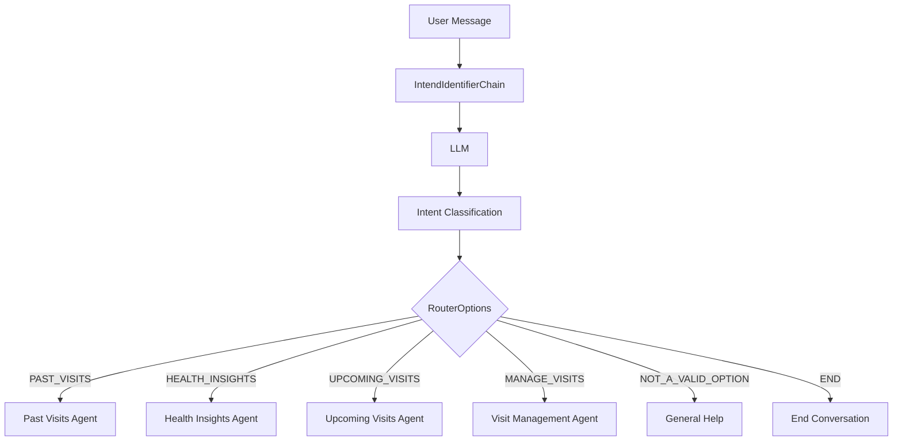

# Intent Identification System

## Overview
The Intent Identification System is a core component of the Care Capture AI application that analyzes user messages to determine their intent. This system uses a language model to classify messages into predefined categories, enabling appropriate routing to specialized agents.

## Architecture



## Components

### 1. Models (`models.py`)
- **AgentState**: TypedDict defining the conversation state structure
  - `messages`: List of conversation messages
  - `next`: String indicating the next action or state
- **RouterOptions**: Enum defining possible intent categories
  - `PAST_VISITS`: For past visits inquiries
    - Sample questions 
      - What did Dr Sarah said in my last visit? 
      - What Dr William talked about my cardio related issues? 
      - What was the recommendations for my High Blood pressure by Dr Will?
      - Can you summarize me about my last Dentist visit? 
      - When should I take my Blood sugar medicine recommended by Dr John?  
  - `HEALTH_INSIGHTS`: For health insights inquiries
    - Sample questions 
      - When should I take my Blood sugar medicine?  
      - Howz my blood pressure reading? 
      - What are my current medications? 
  - `UPCOMING_VISITS`: For upcoming visits inquiries
    - Sample questions 
      - Can you remind me my next visit with Dr Will?
      - When is my next Cardio visit? 
      - When is my next Dentist visit with Dr Sarah?
  - `MANAGE_VISITS`: For managing visits (create, cancel, reschedule, etc.)
    - Sample questions 
      - Add a new visit with Dr Will for next Monday? 
        # System will find Dr Will either from their Bookmark or their Recent visits 
      - I want to cancel my next week appointment with Dr Satish. 
      - I want to update or reschedule my May 2nd appointment with Dr John to May 10th. 
  - `NOT_A_VALID_OPTION`: For invalid queries
  - `END`: For conversation termination

### 2. Chain (`chain.py`)
- **IntendIdentifierChain**: Main class for intent identification
  - Initializes LLM with appropriate settings (GPT-4-mini, temperature=0.2)
  - Processes messages through a specialized prompt
  - Returns classified intent
  - Includes error handling and fallback to GENERAL for invalid responses

### 3. Constants (`constants.py`)
- **INTENT_IDENTIFIER_SYSTEM_PROMPT**: Detailed prompt template that:
  - Provides clear classification instructions
  - Includes example queries for each category
  - Emphasizes confidence in classification
  - Requires exact response format
  - Defaults to NOT_A_VALID_OPTION when uncertain

## Technical Implementation

### Intent Classification Flow
1. User message received
2. Message added to conversation state
3. LLM processes message with specialized prompt
4. Output cleaned and validated
5. Intent classified into RouterOptions
6. Result returned for routing

### Error Handling
- Invalid responses default to NOT_A_VALID_OPTION
- System maintains stability through robust error handling
- Strict output validation ensures consistent responses

## Usage

### API Endpoint
```python
POST /intend-identify
```

Sample curl commands for each intent category:

- PAST_VISITS intents:
```bash
curl -X POST "http://localhost:8000/intend-identify" -H "Content-Type: application/json" -d '{"messages": ["Could you bring up details from my last appointment with Dr. Shah?"]}'
curl -X POST "http://localhost:8000/intend-identify" -H "Content-Type: application/json" -d '{"messages": ["I want to see a list of my recent visits."]}'
```

- HEALTH_INSIGHTS intents:
```bash
curl -X POST "http://localhost:8000/intend-identify" -H "Content-Type: application/json" -d '{"messages": ["Can you show me any trends in my recent health reports?"]}'
curl -X POST "http://localhost:8000/intend-identify" -H "Content-Type: application/json" -d '{"messages": ["Are there any health alerts I should be aware of?"]}'
```

- UPCOMING_VISITS intents:
```bash
curl -X POST "http://localhost:8000/intend-identify" -H "Content-Type: application/json" -d '{"messages": ["When is my next doctor visit scheduled?"]}'
curl -X POST "http://localhost:8000/intend-identify" -H "Content-Type: application/json" -d '{"messages": ["Am I seeing anyone next week for a follow-up?"]}'
```

- MANAGE_VISITS intents:
```bash
curl -X POST "http://localhost:8000/intend-identify" -H "Content-Type: application/json" -d '{"messages": ["I'\''d like to cancel my appointment next Monday."]}'
curl -X POST "http://localhost:8000/intend-identify" -H "Content-Type: application/json" -d '{"messages": ["Can you help me schedule a new check-up with Dr. Kim?"]}'
```

- NOT_A_VALID_OPTION intents:
```bash
curl -X POST "http://localhost:8000/intend-identify" -H "Content-Type: application/json" -d '{"messages": ["Hmm, I'\''m not sure what to do next."]}'
curl -X POST "http://localhost:8000/intend-identify" -H "Content-Type: application/json" -d '{"messages": ["That didn'\''t work, can you give me the correct options again?"]}'
```

- END_CONVERSATION intents:
```bash
curl -X POST "http://localhost:8000/intend-identify" -H "Content-Type: application/json" -d '{"messages": ["Thanks for the help, I'\''m done now."]}'
curl -X POST "http://localhost:8000/intend-identify" -H "Content-Type: application/json" -d '{"messages": ["That'\''s all I needed — ending the session."]}'
```

### CLI Testing
```bash
python -m src.app.chains.intend_identifier.cli
```

## Dependencies
- langchain_core
- langchain
- typing
- enum

## Configuration
The system uses settings from the core configuration module for:
- Model initialization (GPT-4-mini)
- OpenAI API key
- Temperature settings (0.2)
- Error handling parameters 